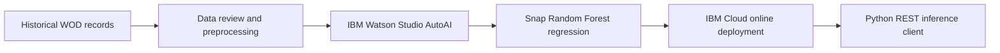

# CrossFit AI Workout Performance Predictor

A regression workflow for analyzing historical CrossFit workouts and estimating workout outcomes with IBM Watson Studio AutoAI.

## Project overview

The workflow uses `best_result_raw` as its regression target. IBM Watson Studio AutoAI generated a candidate pipeline with a Snap Random Forest Regressor, selected by negative RMSE, and exposed the selected model through an IBM Cloud online deployment. A Python client sends inference requests to the deployment.



## Core competencies

- Regression problem framing and target selection
- Exploratory data analysis and tabular data preparation
- Automated machine learning with IBM Watson Studio AutoAI
- Model selection using negative RMSE
- Cloud deployment concepts and REST API inference
- Secure handling of deployment credentials with environment variables

## Tools and libraries

**Python**, **Pandas**, **NumPy**, **Matplotlib**, **Requests**, IBM Watson Studio AutoAI, IBM Cloud / Watson Machine Learning.

## Evidence and limits

The documented workflow includes AutoAI model selection, evaluation visualizations, and an inference example. A final numeric score is not consistently available, so none is claimed here. The AutoAI-generated artifact remains in IBM Cloud; this repository contains analysis code and an inference client, not a portable trained model.

The public repository excludes private workout logs, API keys, access tokens, and cloud credentials. Notebook outputs have been cleared; configure deployment credentials through environment variables when needed.

## Repository code

- `src/workout_analysis.py` — workout history analysis and preprocessing.
- `src/query_deployment.py` — REST inference client configured through environment variables.
- [`workout_data_analysis.ipynb`](workout_data_analysis.ipynb) — exploratory data analysis and model preparation.
- [`autoai_model_pipeline.ipynb`](autoai_model_pipeline.ipynb) — AutoAI pipeline inspection and evaluation.
- [`deployment_inference_client.ipynb`](deployment_inference_client.ipynb) — example inference request to the cloud deployment.

## Setup

```bash
python -m pip install -r requirements.txt
```

Set `IBM_CLOUD_API_KEY` and `IBM_CLOUD_DEPLOYMENT_URL` in your environment only when querying your own authorized deployment. Provide a `payload.json` that matches that deployment's input schema. Use only a local copy of your own authorized records at `workouts.csv`; adapt the input columns as needed. The public repository does not contain the source workout log.

## Data and privacy

The source records came from my personal workout histories in **Wodify** and **SugarWOD**. Those logs are private and are not included in this public repository.

The table below shows the dataset structure with illustrative placeholder values. It is not a copy of actual workout records.

| `date` | `title` | `best_result_raw` | `best_result_display` | `score_type` | `rx_or_scaled` | `pr` |
|---|---|---|---|---|---|---|
| `YYYY-MM-DD` | `Workout A` | `[numeric score]` | `[formatted score]` | `[time / reps / distance]` | `[RX / scaled]` | `[true / false]` |
| `YYYY-MM-DD` | `Workout B` | `[numeric score]` | `[formatted score]` | `[time / reps / distance]` | `[RX / scaled]` | `[true / false]` |

IBM credentials, access tokens, model artifacts, notes, and personal workout records are not published. Use only data you have permission to process.
